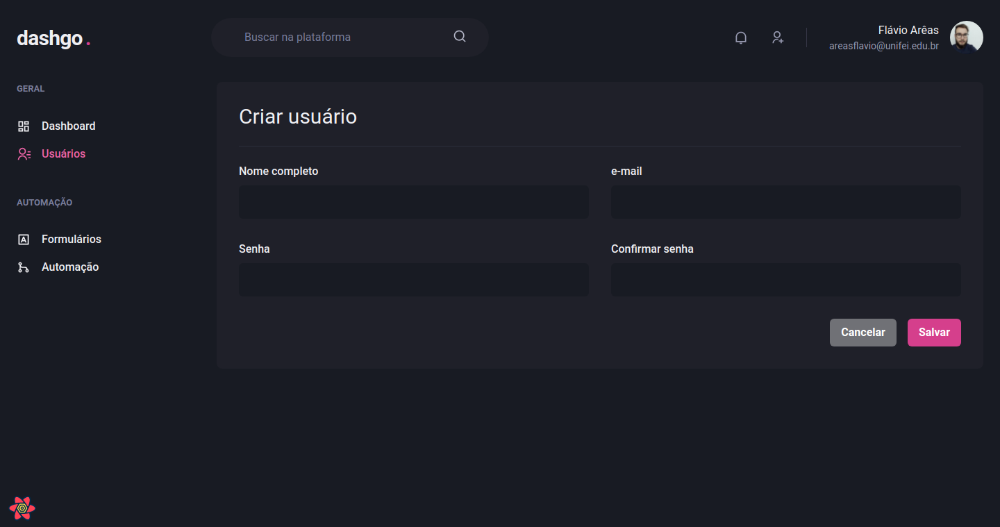

# dashgo

<p align="center">
  
</p>

<h2 align="center">
  An application that provides a dashboard to control actions in any type of system 
  with users. Built using ReactJS, Next.JS, ChakraUI, MirageJS and Typescript.
</h2>

<p align="center">
  

  

  <a href="https://github.com/areasflavio/dashgo/commits/master">
    
  </a>
</p>

<p align="center">
  <a href="#star-features">Features</a>&nbsp;&nbsp;|&nbsp;&nbsp;
  <a href="#keyboard-technologies">Technologies</a>&nbsp;&nbsp;|&nbsp;&nbsp;
  <a href="#computer_mouse-installation">Installation</a>
</p>




<br/>

# :star: Features

[(Back to top)](#dashgo)

This is an application that provides a dashboard to control actions in any type
of system with users. You get a graphical summary of user data, and you also have
control to create new users, edit, delete, sort, filter, and more.

Some key features are:

- Functional application with Next.JS with SSR.
- UI built with ChakraUI.
- API data is fetched and cached using React Query.
- Forms handle by React Hook Form and Yup.
- Charts that display user data.
- Table that displays all users.
- Intuitive sort and filter.

The application is built using ReactJS with Next.JS framework and SSR feature.
Data is provided by an API using MirageJS populated by Faker. The user interface
is built with the amazing ChakraUI declarative component library and is fully
responsive. The entire codebase is written using Typescript.

> Project developed at Chapter IV of Rocketseat's Ignite bootcamp.

<br/>

# :keyboard: Technologies

[(Back to top)](#dashgo)

This is what I used and learned with this project:

- [x] ReactJS
- [x] Next.JS
- [x] ChakraUI
- [x] Framer Motion
- [x] React Hook Form
- [x] Yup
- [x] React ApexCharts
- [x] React Icons
- [x] React Query
- [x] MirageJS
- [x] Faker
- [x] Axios
- [x] Eslint
- [x] Typescript

<br/>

# :computer_mouse: Installation

[(Back to top)](#dashgo)

To use this project, first you need NodeJS running in your device, then you can
follow the commands below:

```bash
# Clone this repository
git clone https://github.com/areasflavio/dashgo.git

# Go into the repository
cd dashgo

# Install dependencies for the application
yarn install

# To start the development server, run the following command
yarn dev
```

# :man_technologist: Author

[(Back to top)](#dashgo)

Build by Flávio Arêas 👋 [Get in touch!](https://www.linkedin.com/in/areasflavio/)
